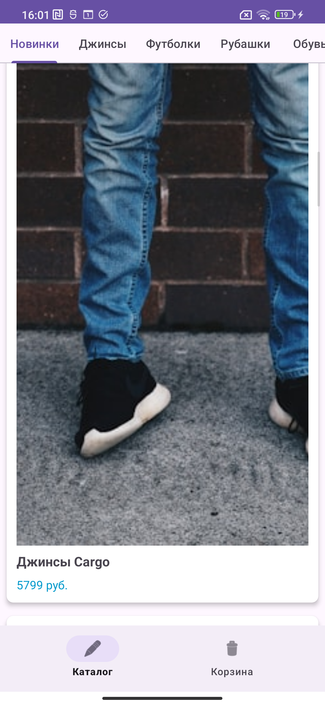
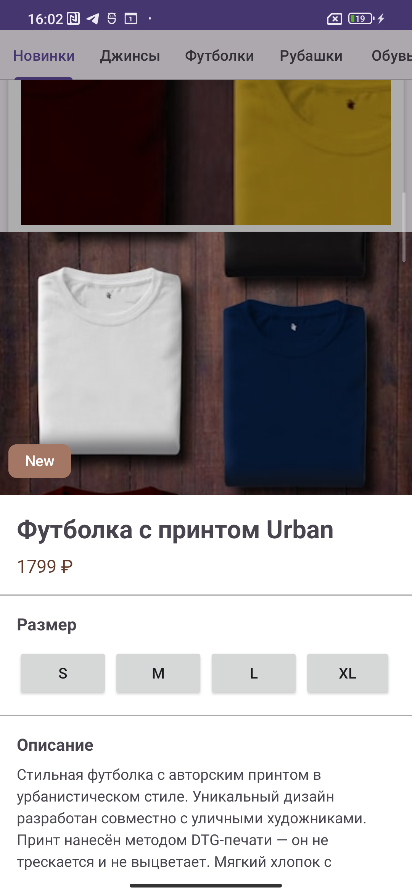
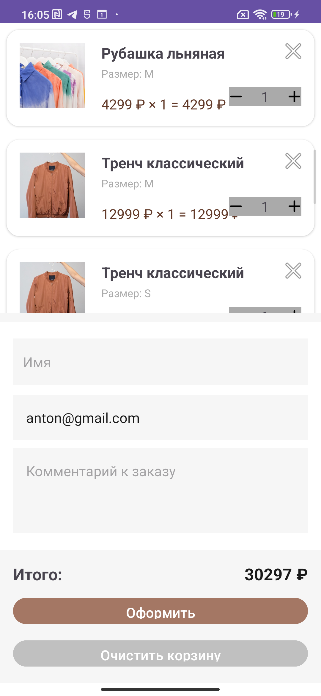
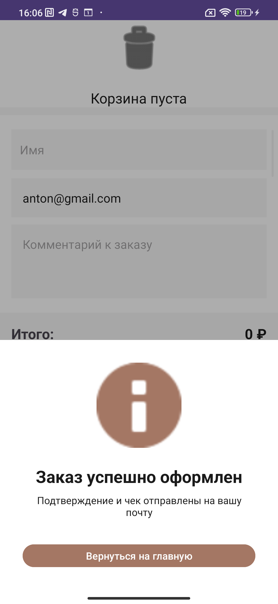

# Team The Two

## Описание проекта
Интернет-магазин одежды для мобильных устройств на Android. Приложение позволяет просматривать каталог товаров, фильтровать по категориям, добавлять товары в корзину с выбором размера и оформлять заказы.

## Стек технологий
- **Платформа:** Android
- **Язык:** Kotlin
- **Минимальная версия:** API 24 (Android 7.0)
- **Сборка:** Gradle (Kotlin DSL)
- **Среда разработки:** Android Studio
- **Сетевые запросы:** Retrofit
- **Хранение данных:** SharedPreferences
- **Загрузка изображений:** Glide

## Состав команды
- Стародуб Любовь: тимлид, разработчик
- Андреева Нария: разработчик
- Соколов Кирилл: разработчик

## Скриншоты экранов

### Экран каталога


### Детали товара (Bottom Sheet)


### Корзина


### Оформление заказа


## Инструкция по сборке

1. Клонировать репозиторий:
   ```bash
   git clone https://github.com/FEIP-FEFU-Mobile-Spring-2026/team-the-two.gitматривать товары, добавлять их в корзину и оформлять заказы.  
Разрабатывается в рамках курса мобильной разработки.


